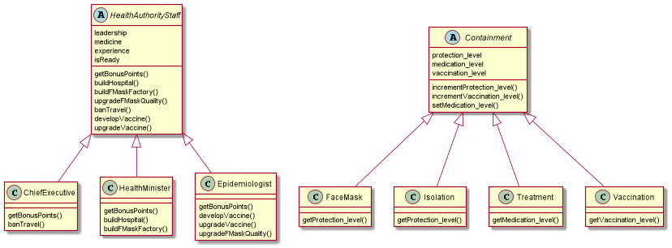

# comp3021-corona-spring2021
Implementing Java Polymorphism, Inheritance, exception raising and handling.
We aim to develop a system as a game to fight Coronavirus.

### Class Diagram of the main packages
The system contains primarly three packages: containment, roles and exception. 
The util package has utility classes. 
#### Roles and containment techniques 

#### Exceptions raised and handled

## How does the game end?
There are 3 winning and losing conditions that end the game:
### 1. The player loses the game in the following conditions:
- When the city/country under a player’s control has infected cases = population. 
- The system game engine raises MedicalException.
- The player runs out of budget.
- The system game engine raises NoMoreBudgetException.
### 2. The player wins the game  
When the city/country under a player’s control has 0 infected cases and 0 new infected cases. If the two players have 0 infected cases and 0 new infected, the game engine computes the points of each player and decides the winner based on the one with greater points.

Finally, the system announce the winner according to infected cases or (if equal) new infected cases or (if equal) players points. 
