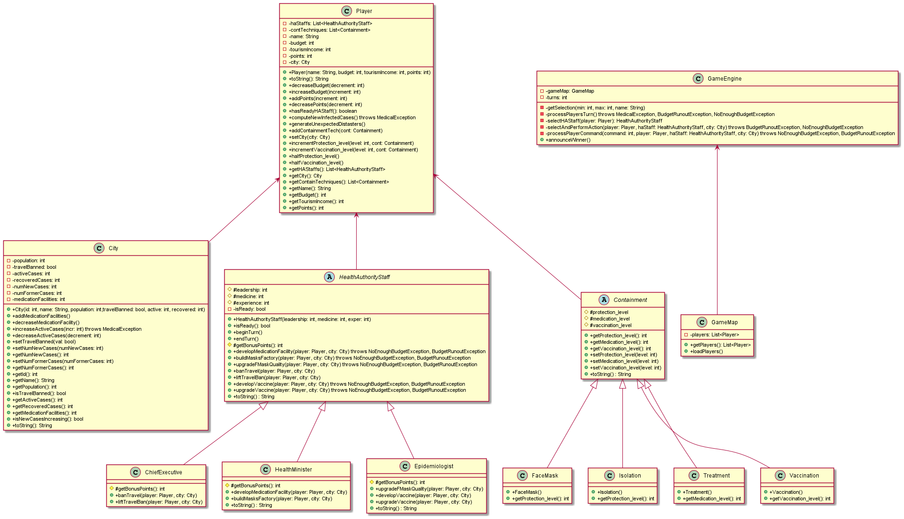
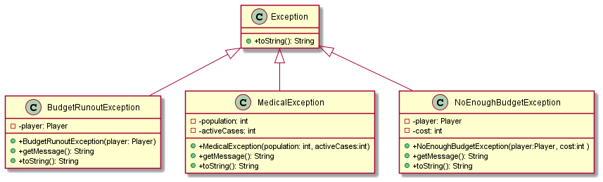

## comp3021 Corona Spring2021
Implementing Java Polymorphism, Inheritance, exception raising and handling.
We aim to develop a system as a game to fight Coronavirus.

### Class Diagram of the main packages
The system contains primarly three packages: containment, roles and exception. 
The util package has utility classes. 
#### Roles and containment techniques and Game engine

#### Exceptions raised and handled

## How does the game end?
There are 3 winning and losing conditions that end the game:
### 1. The player loses the game in the following conditions:
- When the city/country under a player’s control has infected cases = population. The game engine raises MedicalException.
- The player runs out of budget.
- The game engine raises NoMoreBudgetException.
### 2. The player wins the game  
When the city/country under a player’s control has 0 active cases and 0 new infected cases. If the two players have 0 active cases and 0 new infected, the game engine computes the points of each player and decides the winner based on the one with greater points.

Once the system witnesses losing or winning conditions, it announces the winner according to active cases and/or new infected cases and/or players points. 

## Disasters
we can have 3 disasters that would affect the three levels: Protection_level, Vaccination_level, medical_level. 
We need to generate a random variable (calls disaster type) which decides what is the nature of this disaster.
We also need another random variable that determines the propability of disaster occurance. 

Utimately, we have three disaster types that happen with a propability < 0.4:
- Disaster1: Fake face masks that halves the protection
- Disaster2: Weather/physical changes that halves the vaccination efficiency
- Disaster3: Medication facility is out of service
